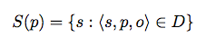
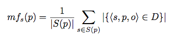
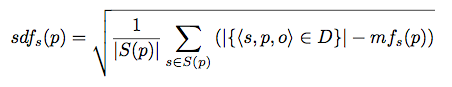
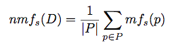

# CostFed Statistics #

For each property **p &isin; P** in a dataset **D**, the set of subjects is defined as:

Then, we computed the mean and standard deviation of the frequency of their respective subjects. The mean frequency of the subjects of a property **p** is defined as

whereas the standard deviation is

Afterwards, for each dataset, we calculated the following indices:

* *net-mean mean frequency* as **nmf**;

* *net-mean standard deviation of frequency* as **nsdf**;

* *net-mean coefficient of variation* as **ncv**, defined as the rate between **nsdf** and **nmf**;

We repeated the steps above also in the other direction, i.e. for the objects (o).

Dataset|nmf_s(D)|nmf_o(D)|nsdf_s(D)|nsdf_o(D)|ncv_s(D)|ncv_o(D)
-----:|-----:|-----:|-----:|-----:|-----:|-----:
ChEBI|2,716.590|11.805|1,409.031|13.275|0.519|1.125
DBpedia|40.185|1.204|68.138|0.373|1.696|0.310
DrugBank|115.752|1.626|140.516|1.185|1.214|0.729
GeoNames|319,304.176|1.248|33,057.456|0.563|0.104|0.451
Jamendo|2,265.057|1.809|2,362.225|0.697|1.043|0.385
KEGG|413.549|14.670|206.219|28.857|0.499|1.967
LinkedMDB|1,158.931|1.149|785.123|0.237|0.677|0.207
NYTimes|1,794.052|3.128|399.821|2.470|0.223|0.790
SWDogFood|10.170|1.870|11.584|0.929|1.139|0.497

As the **ncv** values are way above 0 in almost all cases, 
we can safely assume that the distribution of subjects and objects is not homogeneous.
